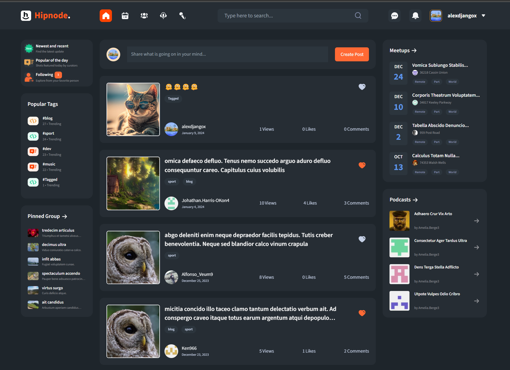
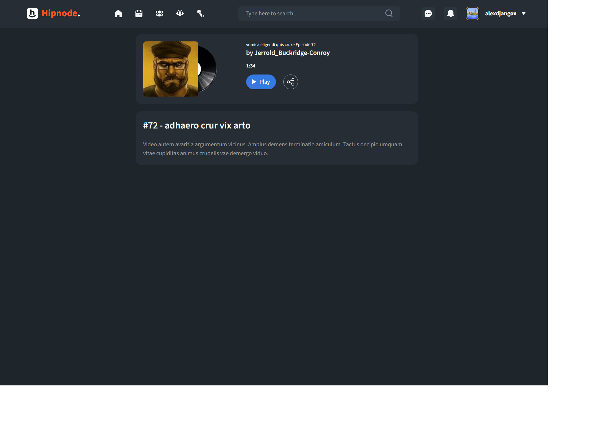
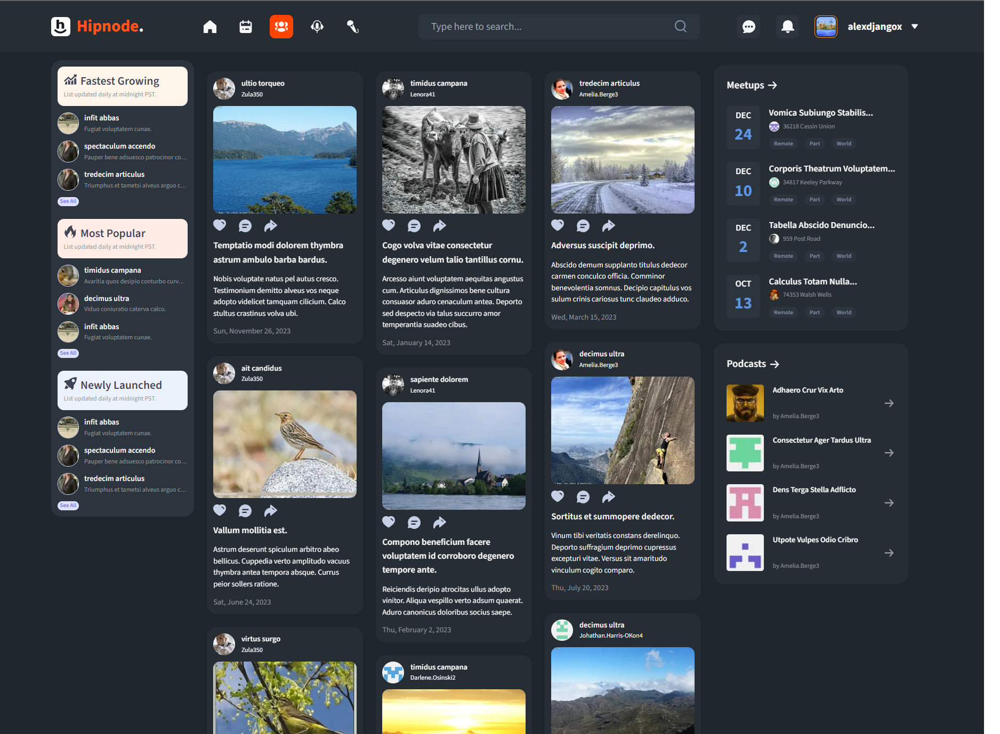
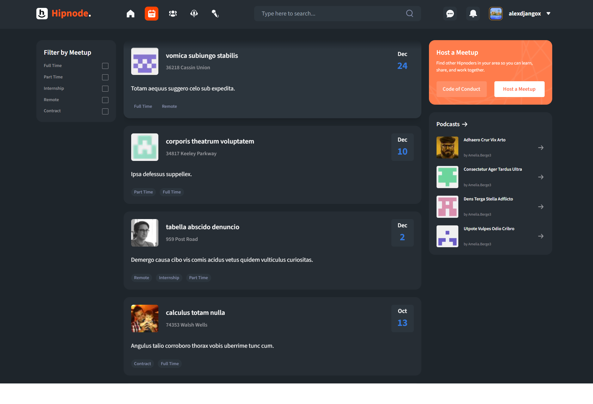
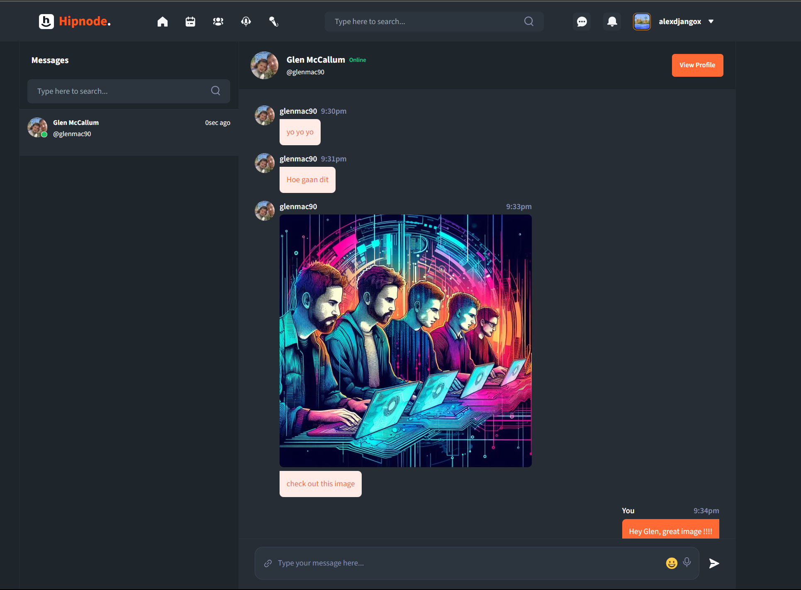
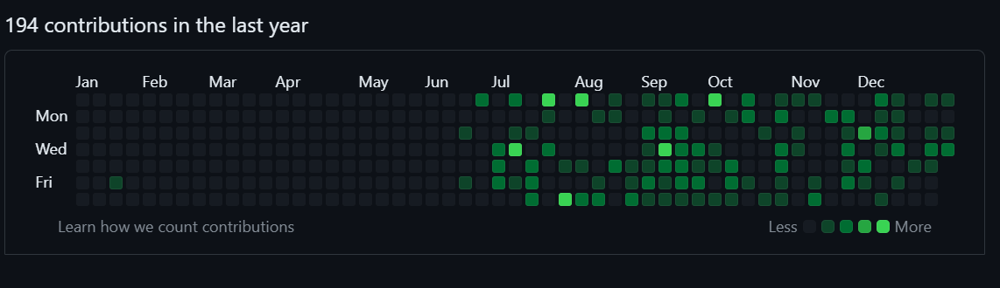
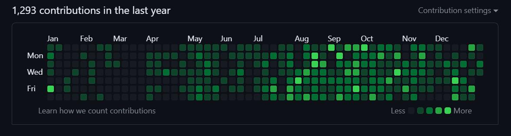

# HIPNODE

# Cohort5_AlgoAlliance_Hipnode

Hipnode is an innovative social media platform featuring posts, podcasts, meetups, interviews, and other interactive functionalities.

This is the Capstone project from JS Mastery Masterclass Experience. The project was engineered over a three month period using a professional UI design created using [Figma](https://www.figma.com/file/RKjPbEbYkvE7XFvYVS8FfZ/Social-Media-Platform?node-id=3901%3A35548&mode=dev).

## Features

- **Posts**: Create and engage with posts. Share your thoughts, experiences, and ideas with a wider community.

  [](https://youtu.be/3hZXbFAARCw "Hipnode - Social Media Platform - Homepage. Create, Read, Update and Delete a Post")

- **Podcasts**: Explore a variety of podcasts on diverse topics or host your own.

  

- **Meetups**: Organize and participate in meetups to connect with people sharing similar interests.

  

- **Interviews**: Discover interviews with a range of personalities, providing insights and inspiration.

  

- **Groups**: Join groups related to your own interests, share posts and other content.

  

- **Live Chat**: Engage in real-time conversations, share instant feedback, and build connections through our interactive live chat feature.

  

## Technologies Used

- **Next.js**: React framework for server-side rendering and static site generation.
- **React**: Library for building user interfaces.
- **TypeScript**: Typed superset of JavaScript.
- **Prisma**: ORM for database operations.
- **Tailwind CSS**: Utility-first CSS framework.
- **Supabase**: Open-source alternative to Firebase.
- **Framer Motion**: Animation library for React.
- **Lexical**: Extensible text editor framework.
- **Radix UI**: Component library for building UI.
- **Other Utilities**: Including emoji support, audio recording, geolocation, etc.
- **Development Tools**: ESLint, Prettier for code linting and formatting.
- **Faker.js**: For generating fake data in development/testing.
- **Resend**: For emailing.

## Setup Guide

### Prerequisites

- Node.js (Refer to
  for installation)
- npm (Comes with Node.js)

### Installation

1. **Clone the repository:**

   ```bash
   git clone https://github.com/JSM-Masterclass-Experience/Cohort5_AlgoAlliance_Hipnode.git

   ```

2. **Navigate to the project directory:**

   ```
   cd Cohort5_AlgoAlliance_Hipnode
   ```

3. **Install dependencies :**

   ```
   npm install

   ```

4. **Ensure you have the following Environmental Variables :**

   ```
   # Clerk Authentication
   NEXT_PUBLIC_CLERK_PUBLISHABLE_KEY=<clerk_publishable_key>
   CLERK_SECRET_KEY=<clerk_secret_key>

   # Clerk URLs
   NEXT_PUBLIC_CLERK_SIGN_IN_URL=/sign-in
   NEXT_PUBLIC_CLERK_SIGN_UP_URL=/sign-up
   NEXT_PUBLIC_CLERK_AFTER_SIGN_IN_URL=/
   NEXT_PUBLIC_CLERK_AFTER_SIGN_UP_URL=/onboarding

   # Direct URL and Database URL
   DIRECT_URL=<direct_url>
   DATABASE_URL=<database_url>

   # Supabase Configuration
   NEXT_PUBLIC_SUPABASE_URL=<supabase_url>
   NEXT_PUBLIC_SUPABASE_ANON_KEY=<supabase_anon_key>

   # Webhook Secret
   WEBHOOK_SECRET=<webhook_secret>

   # Ably API Key
   NEXT_PUBLIC_ABLY_API_KEY=<ably_api_key>

   # Geolocation API Key
   GEOLOCATION_API=<geolocation_api>

   # Google Maps API Key
   GOOGLE_MAPS_API_KEY=<google_maps_api_key>

   # Resend API Key
   RESEND_API_KEY=<resend_api_key>

   ```

5. **Running the Application :**

   ```
    npm run dev
   ```

6. **Install dependencies :**

   ```
   npm install

   ```

7. **Run the Application :**

   ```
   Navigate to http://localhost:3000 in your browser to view the project.

   ```

## Authors

### Glen McCallum - Software Developer

[GitHub Profile](https://github.com/glenmac90)

 

#### Main Tasks

- **Page, Component, and Functionality Development**: Led the development of pages and components for meetups, podcasts, and interviews, adhering to Figma design specifications. Integrated key functionality within these components to enhance interactivity and user engagement. Ensured a polished and responsive user interface across all components.
- **Authentication and User Onboarding**: Implemented user authentication using Clerk and designed a comprehensive onboarding sequence for new users, improving the user experience from the outset.
- **Podcast Player Functionality**: Developed a versatile podcast player, allowing users to enjoy podcasts while browsing other site sections, thus adding a multitasking feature to the platform.
- **Live Chat Feature**: Created an instant messaging feature, enabling real-time communication among users and contributing to a more interactive and connected user community.
- **Global Search Functionality**: Engineered a global search feature across the platform, facilitating efficient and intuitive access to various content types, thereby enhancing user navigation and site usability..
- **Database Design and Query Optimisation**: Contributed to shaping the database architecture using Prisma. Crafted efficient database queries and models, ensuring data integrity and optimal performance. Contributed significantly to the backend development with a focus on scalability and maintainability.

### Alexander Mc Lachlan - Software Developer

[GitHub Profile](https://github.com/AlexDjangoX)

 

#### Main Tasks

- **Database Setup**: Implemented the setup of `PostgreSQL` using `Prisma ORM`. Developed the database models based on the provided `Figma` diagrams to ensure a robust data structure. Created functions and seeded DB using `Faker`.
- **Rich Text Editor**: Created a sophisticated rich text editor utilizing the `Lexical framework`, enhancing the user interface for content creation.
- **Home Page Layout and interactivity**: Responsible for the layout and presentation of the home page, contributing to an intuitive and user-friendly experience.
- **Comments Section Layout and interactivity**: Responsible for the comments section, which allows users to comment on posts and also accepts replies to comments.
- **Form Handling**: Developed multi-purpose form for handling various content types like posts, podcasts, meetups, and interviews. Integrated `react-hook-form` and `zod` for efficient and reliable form management. Leveraging `NextJS 14` `server functions` for all the CRUD operations.
- **Component Creation**: Translated Figma diagrams into requisite `React` components, ensuring a seamless alignment between design and functionality.
- **Component Styling and Animation**: Leveraging `Tailwind CSS` and `Framer Motion` to satisfy Figma requirements and add subtle animation.

### Tye Stanley - Software Developer

[GitHub Profile](https://github.com/)

#### Main Tasks

- **Page, Component, and Functionality Development**: Led the development of pages and components for meetups, podcasts, and interviews, adhering to Figma design specifications. Integrated key functionality within these components to enhance interactivity and user engagement. Ensured a polished and responsive user interface across all components.
- **Authentication and User Onboarding**: Implemented user authentication using Clerk and designed a comprehensive onboarding sequence for new users, improving the user experience from the outset.
- **Podcast Player Functionality**: Developed a versatile podcast player, allowing users to enjoy podcasts while browsing other site sections, thus adding a multitasking feature to the platform.
- **Live Chat Feature**: Created an instant messaging feature, enabling real-time communication among users and contributing to a more interactive and connected user community.
- **Global Search Functionality**: Engineered a global search feature across the platform, facilitating efficient and intuitive access to various content types, thereby enhancing user navigation and site usability..
- **Database Design and Query Optimisation**: Contributed to shaping the database architecture using Prisma. Crafted efficient database queries and models, ensuring data integrity and optimal performance. Contributed significantly to the backend development with a focus on scalability and maintainability.

### Taehong Min - Software Developer

[GitHub Profile](https://github.com/)

#### Main Tasks

- **Page, Component, and Functionality Development**: Led the development of pages and components for meetups, podcasts, and interviews, adhering to Figma design specifications. Integrated key functionality within these components to enhance interactivity and user engagement. Ensured a polished and responsive user interface across all components.
- **Authentication and User Onboarding**: Implemented user authentication using Clerk and designed a comprehensive onboarding sequence for new users, improving the user experience from the outset.
- **Podcast Player Functionality**: Developed a versatile podcast player, allowing users to enjoy podcasts while browsing other site sections, thus adding a multitasking feature to the platform.
- **Live Chat Feature**: Created an instant messaging feature, enabling real-time communication among users and contributing to a more interactive and connected user community.
- **Global Search Functionality**: Engineered a global search feature across the platform, facilitating efficient and intuitive access to various content types, thereby enhancing user navigation and site usability..
- **Database Design and Query Optimisation**: Contributed to shaping the database architecture using Prisma. Crafted efficient database queries and models, ensuring data integrity and optimal performance. Contributed significantly to the backend development with a focus on scalability and maintainability.

## License

This project is licensed under the [MIT] License.

## Acknowledgments

- Adrian Hajdin who makes this possible through his amazing team of Mentors
- The tireless support we received throughout the Master Class
- Amazing workshops run be mentors based on participant requests
- Regular meetups withy mentors in the Office-hours platform
- One on one mentorship we all received
- An amazing Dev Team of diverse people from across the globe
